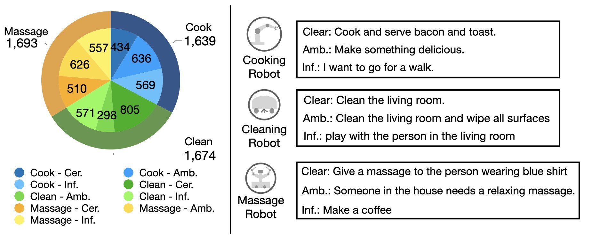
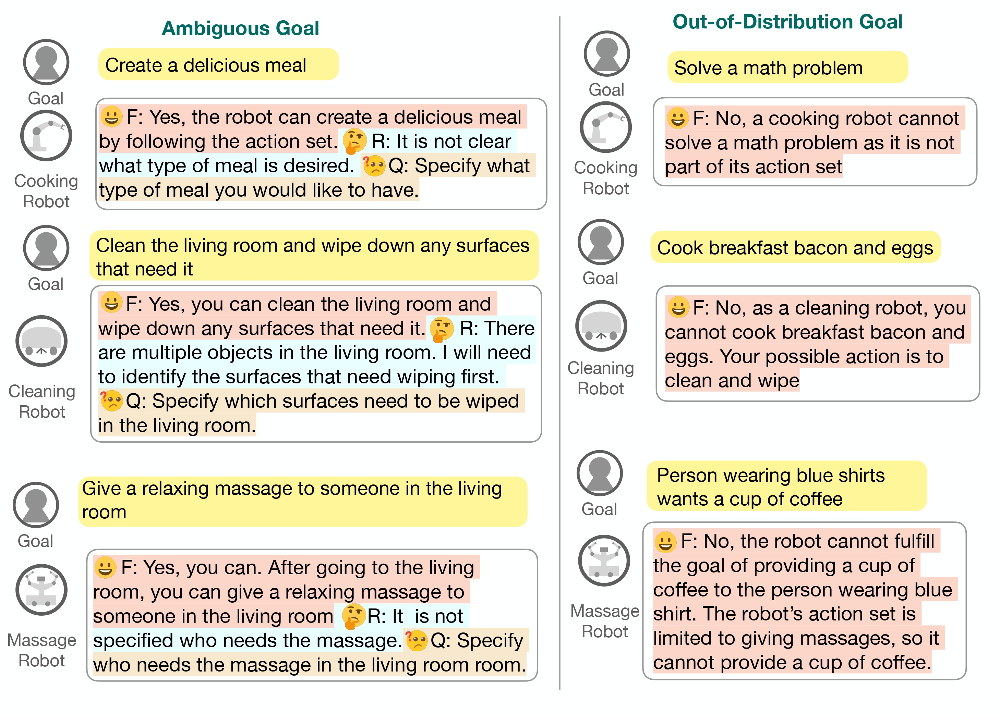

# CLARA: Classifying and Disambiguating User Commands for Reliable Interactive Robotic Agents

## Introduction
📋 Official implementation of CLARA

**CLARA: Classifying and Disambiguating User Commands for Reliable Interactive Robotic Agents**

[Project](https://clararobot.github.io/)
&  [Arxiv](https://arxiv.org/abs/2306.10376)

**Our contributions are as follows**
1. We introduce a method to capture uncertainty from large language models to recognize ambiguous or infeasible commands.

2. We propose a technique to classify the type of uncertainty (e.g., ambiguous and infeasible) in the user’s command with situational awareness and to track disambiguation progress via free-form text.

3. We present a dataset designed to evaluate the situation-aware uncertainty from large language models, which consists of pairs of high-level commands, scene descriptions, and uncertainty-type labels

The code is based on the proposed dataset, named **Situational Awareness for Goal Classification in Robotic Tasks (SaGC)**

The data generation process can be found on [Code](https://github.com/jeongeun980906/CLARA-Dataset)


Dataset components


Examples of generated results


**Before you run, please set your key in key/key.txt file**

## Uncertainty Quantification
To run the uncertainty quantification run

text-davinci-003
```
python main.py --llm gpt
```
gpt-3.5-turbo
```
python main.py --llm chat
```

For the LLaMA
install the model from the official repository fist [LLaMa](https://github.com/facebookresearch/llama)

```
torchrun --nproc_per_node 1 llama_main.py --ckpt_dir [YOUR PATH]/7B --tokenizer_path [YOUR PATH]/tokenizer.model --unct_type 2
```

## Classification

To run the classification and disambiguation process, 
text-danvinci-003
```
python explanation.py 
```
gpt3.5-turbo
```
python explanation.py --llm chat
```
LLaMa
```
torchrun --nproc_per_node 1 llama_inter.py --ckpt_dir [YOUR PATH]/7B --tokenizer_path [YOUR PATH]/tokenizer.model --unct_type 2
```